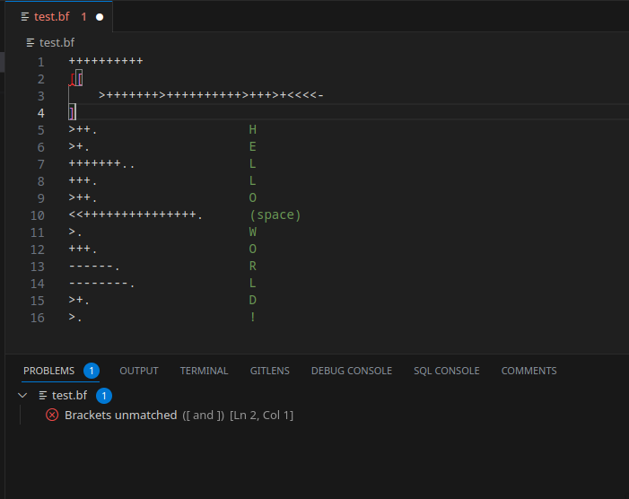
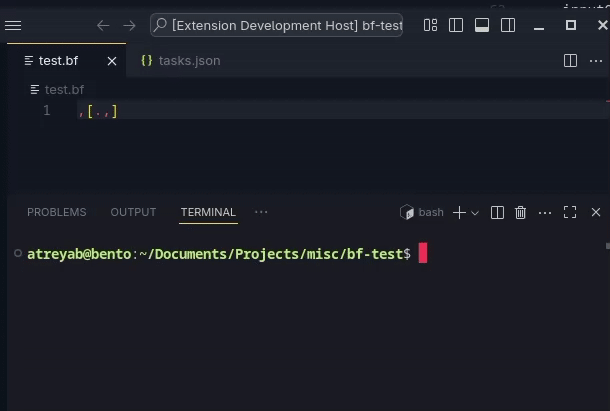

# BF extension

A simple language server based VSCode Extension for the (Branflakes?) (BrainFuck?) BF language. You can also execute your code and see its output.

## Functionality

- Syntax Highlighting
- Execution
- Autocomplete suggestions

### Execution

Use the BF execute task to execute the code. 
Either run the "current file" task, or create a customized task with the required file.
I/O is done on the created terminal window.

There is also an older command to run the code, where output is shown as a status message. Here, if the program requires input, it will be requested as a prompt.

### Changelog

#### 0.3.0

- Added a task for execution
  - Press Control C to halt it while its waiting for input
  - Close task to abort execution
    - Detail: The program will halt between loop iterations.
- Migrated the run command to `bf.execute.old`

#### 0.2.1

- Change category
- Small bugfix for brackets validation

#### 0.2.0

- Cycle input pointer on overflow/underflow
- Refactoring code

#### 0.1.0

- Request input as required during execution
- Using array-based indexing. This implies that only positive indices upto 30k are supported.

### Building it

1. `npm i` - Install all dependencies
2. `npm i -g @vscode/vsce` - Install VSCode Command line CLI
3. `vsce package` - Package to VSIX